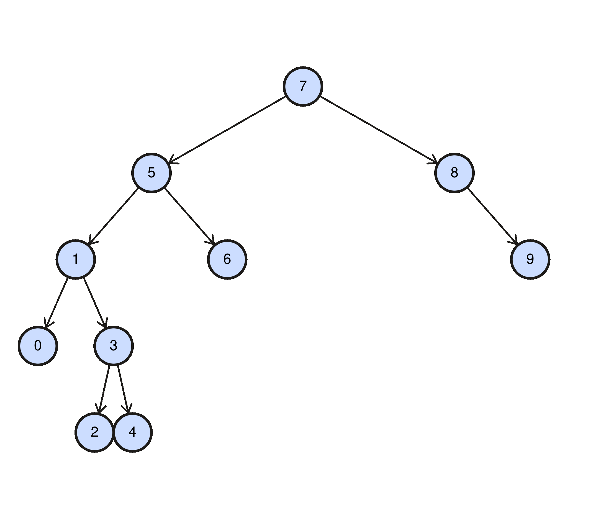

# Patika Binary Search Tree Projesi - Proje 3
##### Bu repo [Patika](http://www.patika.dev) sitesi Veri Yapıları ve Algoritmalar dersi Projeler bölümünde bulunan Binary Search Tree Projesi - Proje 3 çalışması için oluşturulmuştur.
>[7, 5, 1, 8, 3, 6, 0, 9, 4, 2] dizisinin Binary-Search-Tree aşamalarını yazınız.

- Root olarak 7 seçilmiştir.
- 5, roottan küçük olduğu için rootun soluna eklenir.
- 1, root ve 5 ten küçük olduğu için rootun soluna eklenir.
- 8, roottan büyük olduğu için rootun sağına eklenir.
- 3, root ve 5 ten küçük olduğu için 5 in soluna ancak 1 büyük olduğu için 1 in sağına eklenir.
- 6, roottan küçük olduğu için rootun soluna ancak 5 ten büyük olduğundan 5 in sağına eklenir.
- 0, root, 5 ve 1 den küçük olduğu için 1 in soluna eklenir.
- 9, root ve 8 den büyük olduğu için 8 in sağına eklenir.
- 4, root ve 5 ten küçük olduğundan 5 in soluna ancak 1 ve 3 ten büyük olduğu için 3 ün sağına eklenir.
- 2, root ve 5 ten küçük olduğundan 5 in soluna ancak 1 den büyük olduğu için 1 in sağına ve son olarakta 3 ten küçük olduğundan 3 ün soluna eklenir.
